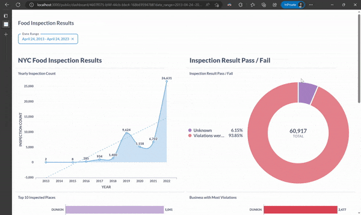

[](https://github.com/piyush-an/NYC-Restaurant-Inspection/actions/workflows/static.yml)

# NYC Food Inspection

## Problem Statement
Explore NYC Food Inspections result over the period of 10 years to derive insights related to following
* Inspection over the years
* Inspection results
* Which restaurants were most inspected
* Which restaurants were involved in most violation
* Other inferences as observed during the course of visualization

## Dataset

DOHMH New York City Restaurant Inspection Results by NYC OpenData

* Dataset - [OpenData](https://data.cityofnewyork.us/Health/DOHMH-New-York-City-Restaurant-Inspection-Results/43nn-pn8j)
* Data Dictionary - [Excel](https://data.cityofnewyork.us/api/views/43nn-pn8j/files/ec33d2c8-81f5-499a-a238-0213a38239cd?download=true&filename=RestaurantInspectionDataDictionary_09242018.xlsx)

## Architecture Diagram


## Data Modeling


List of dimension and fact tables 

|        **Dimension**       |              **Fact**             |
|:--------------------------:|:---------------------------------:|
| dim_addresses          | fct_food_inspections          |
| dim_borough            | fct_foodinspection_violations |
| dim_critical_flag      |                                   |
| dim_cuisine            |                                   |
| dim_food_places        |                                   |
| dim_inspection_actions |                                   |
| dim_inspection_grades  |                                   |
| dim_inspection_type    |                                   |
| dim_violation_codes    |                                   |

# Data Loading

dbt workflow to load data into dim and fact tables, [dbt docs](https://piyush-an.github.io/NYC-Restaurant-Inspection)


## Steps for Recreation

> Keeping ease of reproducibility at foremost priority I have avoided to choose dbt cloud and keep all application containerized. Incase one does not have enough resources (Min 8 GB of RAM) on local, they can follow the cloud deployment by provisioning a virtual machine on GCP cloud.

There is no publicly accessible instance running, follow one of the two approaches.

1. [Cloud deployment](terraform/README.md)
2. [Local deployment](docs/local_deploy.md)


## Visualization




## Inference
For no filter based on the date, summing up the conclusion
* A total of 64k inspection carried out
* Average score inspection were 20
* 4k places have never been inspected
* 208k violation are recorded
* Manhattan has most number of places, 24k
* 2% of the inspections have passed result
* 8k places have been closed down due to sever violations
* year 2022 had the most inspection of about 26k
* January is the month when most inspection happen
* Dunkin is the most inspected as well as most violated place
* A major of the place are based on American cuisine followed by Chinese, Coffee and Pizza


## Source Code Reference

```bash
.
├── Makefile
├── airflow
│   └── dags
│       └── load_all_data.py
├── dbt_nyc
│   ├── dbt_project.yml
│   ├── models
│   │   ├── core
│   │   │   ├── dim_addresses.sql
│   │   │   ├── dim_borough.sql
│   │   │   ├── dim_critical_flag.sql
│   │   │   ├── dim_cuisine.sql
│   │   │   ├── dim_food_places.sql
│   │   │   ├── dim_inspection_actions.sql
│   │   │   ├── dim_inspection_grades.sql
│   │   │   ├── dim_inspection_type.sql
│   │   │   ├── dim_violation_codes.sql
│   │   │   ├── fact_food_inspections.sql
│   │   │   ├── fact_foodinspection_violations.sql
│   │   │   └── schema.yml
│   │   └── staging
│   │       ├── load_stg_data.sql
│   │       └── schema.yml
│   ├── packages.yml
│   └── profiles.yml
├── docker-compose.yaml
├── great_expectations
│   ├── checkpoints
│   │   └── nyc_food_inspection_v05.yml
│   ├── expectations
│   │   └── nyc_food_inspection_suite_v2.json
│   └── great_expectations.yml
├── requirements.txt
├── terraform
│   ├── install.sh
│   ├── main.tf
│   ├── output.tf
│   ├── terraform.tfvars
│   └── variables.tf
└── user_data
    ├── init.sql
    └── metabase-2023-04-25.sql
```
