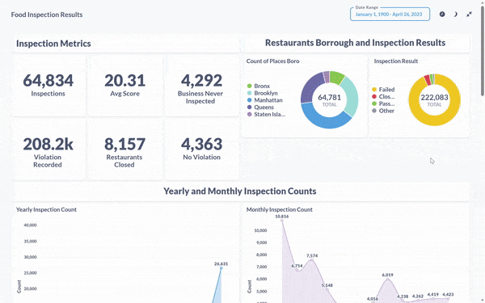

# NYC Food Inspection

## Problem Statement
Explore NYC Food Inspections result over the period of 10 years to derive insights related to following
* Inspection over the years
* Inspection results
* Which restaurants were most inspected
* Which restaurants were involved in most violation
* Other inferences as observed during the course of visualization

## Dataset

DOHMH New York City Restaurant Inspection Results by NYC OpenData

* Dataset - [OpenData](https://data.cityofnewyork.us/Health/DOHMH-New-York-City-Restaurant-Inspection-Results/43nn-pn8j)
* Data Dictionary - [Excel](https://data.cityofnewyork.us/api/views/43nn-pn8j/files/ec33d2c8-81f5-499a-a238-0213a38239cd?download=true&filename=RestaurantInspectionDataDictionary_09242018.xlsx)

## Architecture Diagram

## Data Modeling

List of dimension and fact tables 

|        **Dimension**       |              **Fact**             |
|:--------------------------:|:---------------------------------:|
| dim_nyc_addresses          | fct_nyc_food_inspections          |
| dim_nyc_borough            | fct_nyc_foodinspection_violations |
| dim_nyc_critical_flag      |                                   |
| dim_nyc_cuisine            |                                   |
| dim_nyc_food_places        |                                   |
| dim_nyc_inspection_actions |                                   |
| dim_nyc_inspection_grades  |                                   |
| dim_nyc_inspection_type    |                                   |
| dim_nyc_violation_codes    |                                   |

## Steps for Recreation

> Keeping ease of reproducibility at foremost priority I have avoided to choose dbt cloud and keep all application containerized. Incase one does not have enough resources (Min 8 GB of RAM) on local, they can follow the cloud deployment by provisioning a virtual machine on GCP cloud.

There is no publicly accessible instance running, follow one of the two approaches.

1. [Cloud deployment](terraform/README.md)
2. [Local deployment](docs/local_deploy.md)

## Visualization

## Inference

## Source Code Reference

